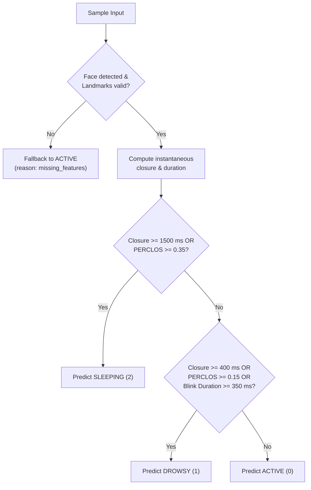

# Vigil M2 Rule-Based Baseline Architecture & Evaluation

## 1. Overview and Purpose

This document specifies the architecture, decision rules, configurable parameters, and evaluation methodology for the **Milestone 2 Day 3 (M2 D3) Rule-Based Fatigue Baseline** in the Vigil Driver Drowsiness Detection system.

The primary purpose of the rule baseline is to establish a deterministic, explainable heuristic benchmark against which learned machine learning and deep learning models (D5/D6) will be evaluated under the exact same evaluation protocol.

---

## 2. Target Classes

The rule baseline maps observed feature streams exclusively to the canonical three-state fatigue classes established in `docs/m2-data-contract.md`:

| Class Name | Integer ID | Description |
|---|---|---|
| `ACTIVE` | `0` | Alert, attentive driver exhibiting normal ocular alertness and blink kinetics. |
| `DROWSY` | `1` | Transition state characterized by sluggish blinks, elevated PERCLOS, or prolonged closures. |
| `SLEEPING` | `2` | Acute hazardous fatigue state defined by sustained eye closure (microsleep/sleep) or extreme PERCLOS. |

*Annotation State Handling*: Ambiguous ground truth samples (`label_id = -1`) are excluded from benchmark metric calculation. The classifier never outputs `-1` as an operational prediction.

---

## 3. Heuristic Decision Rules

The classifier processes feature inputs sequentially and applies a deterministic priority hierarchy:

### 3.1 Decision Hierarchy

1. **Priority 1: SLEEPING (Class 2)**
   * *Trigger A (Acute Closure)*: Continuous eye closure duration $\ge 1500\text{ ms}$ (`sleeping_closure_duration_ms`).
   * *Trigger B (Extreme PERCLOS)*: Trailing PERCLOS ratio $\ge 0.35$ (`sleeping_perclos_threshold`).
2. **Priority 2: DROWSY (Class 1)**
   * *Trigger A (Prolonged Closure)*: Continuous eye closure duration $\ge 400\text{ ms}$ (`drowsy_closure_duration_ms`).
   * *Trigger B (Elevated PERCLOS)*: Trailing PERCLOS ratio $\ge 0.15$ (`drowsy_perclos_threshold`).
   * *Trigger C (Sluggish Blink)*: Completed blink duration $\ge 350\text{ ms}$ (`drowsy_blink_duration_ms`).
3. **Priority 3: ACTIVE (Class 0)**
   * Default state when neither SLEEPING nor DROWSY conditions are met.

### 3.2 Sustained-Fatigue Alert Controller

* An audible/visible alert condition is activated if:
  * The driver enters the `SLEEPING` state (`immediate_sleep_alert = True`), OR
  * The driver remains continuously in a fatigue state (`DROWSY` or `SLEEPING`) for $\ge 1000\text{ ms}$ (`alert_sustain_window_ms`).
* The alert resets immediately to `False` once the driver returns to `ACTIVE`.

---

## 4. Threshold Configuration & Provisional Status

> [!IMPORTANT]
> **PROVISIONAL STATUS NOTICE**:
> Because actual recorded driver datasets are not yet collected or calibrated in the repository, all threshold values below are **PROVISIONAL** literature heuristics.
> Empirical calibration on recorded validation data splits is pending.

| Parameter | Default Value | Unit / Range | Description |
|---|---|---|---|
| `ear_close_threshold` | `0.20` | $(0.0, 0.60)$ | Eye aspect ratio threshold below which eyes are considered closed. |
| `drowsy_closure_duration_ms` | `400.0` | $\text{ms} > 0$ | Continuous eye closure duration required to enter DROWSY state. |
| `sleeping_closure_duration_ms` | `1500.0` | $\text{ms} > \text{drowsy}$ | Continuous eye closure duration required to enter SLEEPING state. |
| `drowsy_perclos_threshold` | `0.15` | $(0.0, 1.0]$ | Trailing PERCLOS threshold required to trigger DROWSY state. |
| `sleeping_perclos_threshold` | `0.35` | $(0.0, 1.0]$ | Trailing PERCLOS threshold required to trigger SLEEPING state. |
| `drowsy_blink_duration_ms` | `350.0` | $\text{ms} \ge 0$ | Single blink duration indicating a sluggish, fatigued blink. |
| `alert_sustain_window_ms` | `1000.0` | $\text{ms} \ge 0$ | Continuous fatigue duration required before triggering alert. |
| `immediate_sleep_alert` | `True` | `bool` | Trigger alert immediately upon entering SLEEPING state. |
| `missing_feature_fallback` | `FatigueLabel.ACTIVE` | Canonical class | Fallback prediction when face or landmarks are missing. |

---

## 5. Missing-Feature Policy

When video frames suffer from occlusion, extreme head pose, or lighting dropouts:
* If `face_detected is False` or `landmarks_valid is False`, ocular features (`ear_avg`, `is_eye_closed`) cannot be observed.
* The classifier **never fabricates ocular values** or accumulates phantom eye closure.
* Temporal eye closure duration tracking is immediately reset to $0.0\text{ ms}$.
* The classifier safely outputs `missing_feature_fallback` (`ACTIVE = 0`) with reason `missing_features`.

---

## 6. Evaluation Protocol Compliance

All baseline evaluations strictly comply with `docs/m2-evaluation-protocol.md`:

1. **Independent Predictions**:
   * Ground-truth labels (`sample.label`, `sample.label_id`) are never read or referenced during inference.
2. **Mandatory 5 Core Metrics**:
   * Overall Accuracy
   * Per-Class and Macro Precision
   * Per-Class and Macro Recall
   * Macro F1 Score
   * $3 \times 3$ Confusion Matrix (strictly ordered: `[0: ACTIVE, 1: DROWSY, 2: SLEEPING]`)
3. **Zero-Division Rule**:
   * If $TP_c + FP_c = 0$ or $TP_c + FN_c = 0$, precision, recall, and F1 evaluate to $0.0$.
4. **Zero-Support Integrity**:
   * Classes with zero ground-truth validation samples are explicitly identified and flagged as limitations, prohibiting ungrounded benchmark claims.
5. **Grouped Session Partitioning**:
   * Evaluated sessions are partitioned using `group_split_sessions` to prevent contiguous frame autocorrelation leakage.

---

## 7. Known Baseline Limitations

While the rule baseline provides a robust, fast, and explainable starting point, it has several fundamental limitations:
1. **Lack of Individual Adaptation**: Fixed global EAR thresholds do not account for natural subject-to-subject variation in eye openness, glasses, or facial morphology.
2. **Threshold Rigidity**: Abrupt step thresholds (e.g. at 399 ms vs 400 ms) lack soft probabilistic confidence.
3. **No Complex Spatiotemporal Modeling**: Heuristics evaluate simple scalar summaries rather than full temporal feature trajectories.

These limitations motivate the deep learning sequence models planned for M2 Days 5 and 6.
