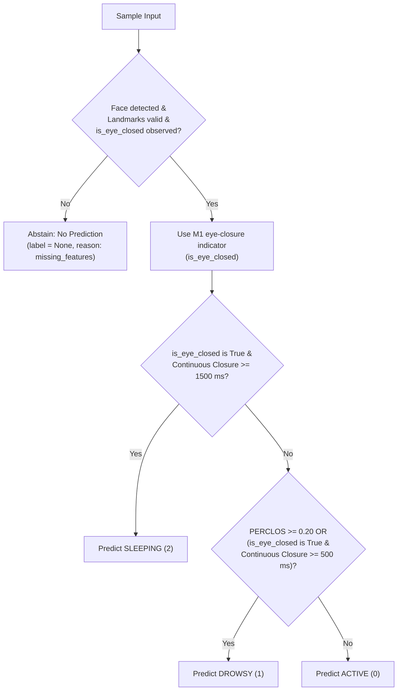

# Vigil M2 Rule-Based Baseline Architecture & Evaluation

## 1. Overview and Purpose

This document specifies the architecture, decision rules, configurable parameters, and evaluation methodology for the **Milestone 2 Day 3 (M2 D3) Rule-Based Fatigue Baseline** in the Vigil Driver Drowsiness Detection system.

The primary purpose of the rule baseline is to establish a deterministic, explainable heuristic benchmark against which learned machine learning and deep learning models (D5/D6) will be evaluated under the exact same evaluation protocol.

---

## 2. Target Classes and Abstention Policy

The rule baseline maps observed feature streams to the canonical three-state fatigue classes established in `docs/m2-data-contract.md`, or outputs an explicit abstention (`None`):

| State | Output | Description |
|---|---|---|
| `ACTIVE` | `0` | Alert, attentive driver exhibiting normal ocular alertness and blink kinetics. |
| `DROWSY` | `1` | Transition state characterized by causal PERCLOS $\ge 0.20$ or continuous closure $\ge 500\text{ ms}$. |
| `SLEEPING` | `2` | Acute hazardous fatigue state: eyes currently closed with continuous closure $\ge 1500\text{ ms}$. |
| **Abstention** | `None` | Explicit no-prediction result when face is undetected, landmarks are invalid, or `is_eye_closed` is unavailable. |

> [!IMPORTANT]
> **ABSTENTION INTEGRITY**:
> Missing features must never become `ACTIVE` predictions. Turning unobserved features into an apparently alert driver would introduce critical safety risks and artificially inflate evaluation metrics.

*Annotation State Handling*: Ambiguous ground truth samples (`label_id = -1`) are excluded from supervised benchmark metrics.

---

## 3. Heuristic Decision Rules

The classifier processes feature inputs sequentially and applies a deterministic priority hierarchy:

### 3.1 Decision Hierarchy

1. **Abstention Check**:
   * If `face_detected is False`, `landmarks_valid is False`, or `is_eye_closed is None`:
   * Emit no prediction (`label = None`, `label_id = None`, `has_prediction = False`, `reason = "missing_features"`).
2. **Instantaneous Eye Closure**:
   * M2 strictly consumes the supplied M1 eye-closure indicator (`sample.is_eye_closed`).
   * M2 does **not** re-derive eye closure from `ear_avg`.
3. **Priority 1: SLEEPING (Class 2)**:
   * Condition: Eyes are currently closed (`is_eye_closed is True`) AND continuous closure duration $\ge 1500\text{ ms}$ (`sleeping_closure_duration_ms`).
   * **Invariant**: `SLEEPING` is **never triggered solely from PERCLOS** when eyes are open.
4. **Priority 2: DROWSY (Class 1)**:
   * Condition A: Causal PERCLOS ratio $\ge 0.20$ (`drowsy_perclos_threshold`), OR
   * Condition B: Eyes are currently closed (`is_eye_closed is True`) AND continuous closure duration $\ge 500\text{ ms}$ (`drowsy_closure_duration_ms`).
5. **Priority 3: ACTIVE (Class 0)**:
   * Default state when observations are valid and neither SLEEPING nor DROWSY conditions are met.

### 3.2 Sustained-Fatigue Alert Controller

* An audible/visible alert condition is activated if:
  * The driver enters the `SLEEPING` state (`immediate_sleep_alert = True`), OR
  * The driver remains continuously in a fatigue state (`DROWSY` or `SLEEPING`) for $\ge 1000\text{ ms}$ (`alert_sustain_window_ms`).
* The alert resets immediately to `False` once the driver returns to `ACTIVE` or observations are lost.

---

## 4. Threshold Configuration & Provisional Status

> [!IMPORTANT]
> **PROVISIONAL STATUS NOTICE**:
> Because empirical recordings are not yet collected or calibrated in the repository, all threshold values below are **PROVISIONAL** literature heuristics.
> Empirical calibration on recorded validation data splits is pending.

| Parameter | Default Value | Unit / Range | Description |
|---|---|---|---|
| `drowsy_closure_duration_ms` | `500.0` | $\text{ms} > 0$ | Continuous eye closure duration required to enter DROWSY state. |
| `sleeping_closure_duration_ms` | `1500.0` | $\text{ms} > \text{drowsy}$ | Continuous eye closure duration required to enter SLEEPING state. |
| `drowsy_perclos_threshold` | `0.20` | $(0.0, 1.0]$ | Trailing causal PERCLOS threshold required to trigger DROWSY state. |
| `alert_sustain_window_ms` | `1000.0` | $\text{ms} \ge 0$ | Continuous fatigue duration required before triggering alert. |
| `immediate_sleep_alert` | `True` | `bool` | Trigger alert immediately upon entering SLEEPING state. |

---

## 5. Abstention-Aware Evaluation Protocol

All baseline evaluations strictly comply with `docs/m2-evaluation-protocol.md`:

1. **Independent Predictions**:
   * Ground-truth labels (`sample.label`, `sample.label_id`) are never read or referenced during inference.
2. **Prediction Coverage and Abstentions**:
   * Missing-feature samples where the model abstains are counted in `skipped_predictions`.
   * Prediction coverage is explicitly reported:
     $$\text{Coverage} = \frac{N_{\text{evaluated}}}{N_{\text{eligible}}}$$
   * Abstentions are **never scored as correct ACTIVE predictions**.
3. **Mandatory 5 Core Metrics**:
   * Overall Accuracy (computed over evaluated predictions)
   * Per-Class and Macro Precision
   * Per-Class and Macro Recall
   * Macro F1 Score
   * $3 \times 3$ Confusion Matrix (strictly ordered: `[0: ACTIVE, 1: DROWSY, 2: SLEEPING]`)
4. **Subject-First Grouped Splitting**:
   * **Primary Split**: Group by `subject_id`. All sessions belonging to a specific subject reside entirely within either the Training partition or the Validation partition.
   * **Fallback**: When only a single subject exists across recordings, fall back to continuous `session_id` grouping and explicitly report that evaluation is restricted to session-level generalization.
   * **Integrity**: Random row-level or window-level splitting is strictly prohibited. If fewer than 2 groups exist, the system reports that a valid held-out partition is impossible rather than manufacturing a leaky split.
