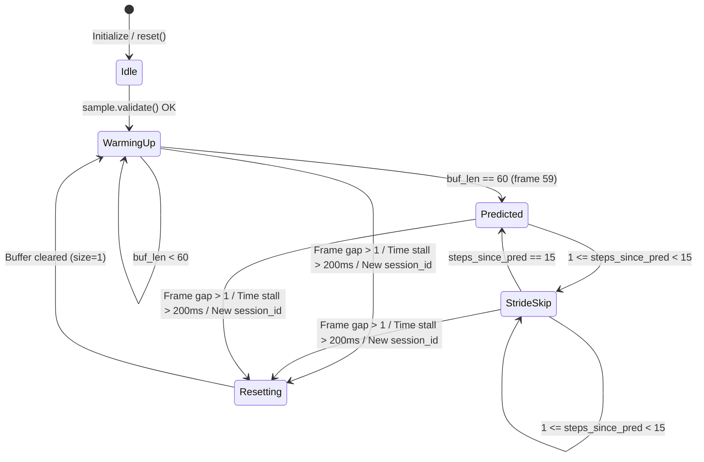

# Vigil M2 Model Export, Runtime Inference, and Evaluation Comparison

## 1. Overview and Purpose

This document specifies the artifact export bundle format, stateful streaming runtime inference engine, and head-to-head baseline evaluation protocol implemented for **Milestone 2 Day 6 (M2 D6)** of the Vigil Driver Drowsiness Detection system.

M2 D6 bridges offline temporal model training with production runtime readiness by delivering:
1. **Self-Contained Model Bundles**: Versioned `.pt` checkpoints encapsulating the trained GRU weights, architecture configuration, fitted `FeatureNormalizer` state, window configuration ($W=60, S=15$), and canonical class mappings.
2. **Stateful Streaming Inference (`TemporalInferenceEngine`)**: A real-time rolling-window inference component consuming M1 `SampleRecord` objects, respecting warm-up and stride intervals, and enforcing temporal discontinuity resets.
3. **Reproducible Baseline Comparison (`compare_models`)**: A leakage-safe evaluation pipeline benchmarking the learned GRU sequence classifier against the D3 heuristic rule baseline across matched window endpoints and full frame sequences.

---

## 2. Model Export and Loading Specification

The export and loading contracts are implemented in `src/vigil/ml/models/export.py`.

### 2.1 Bundle Schema (`BUNDLE_SCHEMA_VERSION = "1.0.0"`)

An exported model bundle is a self-contained PyTorch serialization dictionary containing all components required for runtime execution without retraining:

```python
{
    "bundle_version": "1.0.0",
    "model_type": "GRUTemporalClassifier",
    "created_at_utc": "2026-10-10T16:00:00.000000+00:00",
    "model_config": {
        "input_dim": 8,
        "hidden_dim": 64,
        "num_layers": 1,
        "num_classes": 3,
        "dropout": 0.0,
        "bidirectional": False,
    },
    "state_dict": OrderedDict(...),  # Tensor weights cloned onto CPU
    "normalizer": {
        "means": {"ear_avg": 0.285, "blink_duration_ms": 142.0, "perclos": 0.110},
        "stds": {"ear_avg": 0.048, "blink_duration_ms": 48.5, "perclos": 0.075},
        "observed_counts": {"ear_avg": 1250, "blink_duration_ms": 1250, "perclos": 1250},
        "is_fitted": True,
    },
    "window_config": {
        "window_length": 60,
        "stride": 15,
        "max_frame_gap": 1,
        "max_time_gap_ms": 200.0,
    },
    "feature_channels": [
        "ear_avg",
        "is_eye_closed",
        "blink_duration_ms",
        "perclos",
        "ear_avg_valid",
        "is_eye_closed_valid",
        "blink_duration_valid",
        "perclos_valid",
    ],
    "class_labels": {
        0: "ACTIVE",
        1: "DROWSY",
        2: "SLEEPING",
    },
    "metadata": {
        "git_commit": "ce02bd7",
        "author": "M2",
        "notes": "Trained on synthetic fixtures for D6 contract validation",
    },
}
```

### 2.2 APIs

#### Exporting: `export_model_bundle`

```python
from vigil.ml.models.export import export_model_bundle

bundle_path = export_model_bundle(
    model=trained_gru,
    normalizer=fitted_normalizer,
    filepath="artifacts/models/gru_bundle.pt",
    metadata={"experiment_id": "exp_001"},
)
```

- Enforces that `normalizer.is_fitted == True`. Unfitted normalizers raise `ValueError`.
- Creates parent directories automatically.
- Detaches and clones model weights onto the CPU to guarantee cross-device loading portability.

#### Loading: `load_model_bundle` / `LoadedModelBundle.from_bundle`

```python
from vigil.ml.models.export import load_model_bundle, LoadedModelBundle

# Via top-level loader
bundle = load_model_bundle("artifacts/models/gru_bundle.pt", map_location="cpu")

# Or via classmethod
bundle = LoadedModelBundle.from_bundle("artifacts/models/gru_bundle.pt")

model = bundle.model              # GRUTemporalClassifier in eval mode
normalizer = bundle.normalizer    # Restored FeatureNormalizer with fitted parameters
window_config = bundle.window_config  # WindowConfig(window_length=60, stride=15, ...)
```

#### Validation & Compatibility Guards

During `load_model_bundle`, the following validations occur:
1. **File Existence**: Raises `FileNotFoundError` if the file does not exist.
2. **Bundle Schema**: Raises `TypeError` if the deserialized payload is not a dictionary.
3. **Required Sections**: Verifies presence of `bundle_version`, `model_config`, `state_dict`, `normalizer`, `window_config`, `feature_channels`, and `class_labels`. Missing sections raise `ValueError`.
4. **Version Compatibility**: Matches major version against `BUNDLE_SCHEMA_VERSION.split(".")[0]`. Incompatible versions raise `ValueError`.
5. **Feature Channel Alignment**: Confirms that channel names and order match `LOCKED_FEATURE_CHANNELS` exactly.
6. **Normalizer Integrity**: Requires `normalizer["is_fitted"] == True` with non-empty means and stds.
7. **Model Reconstruction**: Instantiates `GRUTemporalClassifier` with restored `model_config`, loads `state_dict`, and sets `model.eval()`.

---

## 3. Stateful Streaming Runtime Inference

The streaming engine is implemented in `src/vigil/ml/inference/engine.py`.

`TemporalInferenceEngine` accepts frame-by-frame M1 `SampleRecord` instances in live capture order and emits structured `RuntimeInferenceResult` predictions.

### 3.1 Streaming Contracts and Mechanics



1. **Schema Validation**: Every incoming record is validated against `SampleRecord.validate()`. Invalid or malformed records fail immediately.
2. **Buffer Bounding**: An internal `deque(maxlen=60)` retains at most 60 timesteps.
3. **Warm-Up Phase**:
   - Frames 0 to 58 (first 59 samples): No prediction is emitted (`has_prediction=False`, `reason="buffer_warming_up"`).
   - Frame 59 (60th consecutive valid sample): First prediction is emitted (`has_prediction=True`, `reason="predicted"`).
4. **Stride Cadence ($S=15$)**:
   - Following any prediction, incoming samples roll into the buffer.
   - For steps 1 through 14 after a prediction: `has_prediction=False`, `reason="stride_skip"`.
   - On the 15th step: Next inference is executed on the updated 60-sample window (`has_prediction=True`, `reason="predicted"`).
5. **Session Boundary**:
   - Encountering a different `sample.session_id` automatically invokes `reset()` and initializes the buffer with the new record (`reason="session_reset"`).
6. **Temporal Discontinuity Protections**:
   - **Frame Drops** ($\Delta_{\text{frame}} > 1$): The rolling buffer is cleared, and warm-up restarts from the current frame (`reason="discontinuity_frame_gap"`).
   - **Capture Stalls** ($\Delta t > 200.0\text{ ms}$): The rolling buffer is cleared, and warm-up restarts (`reason="discontinuity_timing_gap"`).
   - A window is **never** silently constructed across a discontinuity.
7. **Monotonicity Enforcement**:
   - Duplicate frame indices ($\text{frame} \le \text{prev\_frame}$) or backward timestamps ($\text{timestamp} \le \text{prev\_timestamp}$) within the same session raise a `ValueError`.
8. **Missing Features & Landmark Imputation**:
   - Frames with missing landmarks (`landmarks_valid=False`) or missing continuous ocular metrics are imputed deterministically using the fitted `FeatureNormalizer` (`imputed_value = 0.0`), with validity masks set to `0.0`. The engine continues streaming without crashing.

### 3.2 Output Schema: `RuntimeInferenceResult`

Each call to `engine.step(sample)` (or `engine.process_sample(sample)`) returns an immutable `RuntimeInferenceResult`:

| Field | Type | Description |
|---|---|---|
| `has_prediction` | `bool` | `True` when a forward model prediction occurred; `False` when warming up or skipping stride. |
| `label` | `str \| None` | Predicted canonical class (`'ACTIVE'`, `'DROWSY'`, `'SLEEPING'`) if predicted, else `None`. |
| `label_id` | `int \| None` | Predicted class integer (`0`, `1`, `2`) if predicted, else `None`. |
| `probabilities` | `dict[str, float] \| None` | Softmax probability distribution across all 3 canonical classes. |
| `confidence` | `float \| None` | Maximum predicted class probability ($P(\hat{y} \mid X)$). |
| `reason` | `str` | Explanatory status code: `'predicted'`, `'buffer_warming_up'`, `'stride_skip'`, `'session_reset'`, `'discontinuity_frame_gap'`, `'discontinuity_timing_gap'`. |
| `session_id` | `str` | Identifier of the active recording session. |
| `buffer_size` | `int` | Number of samples currently held in the rolling buffer ($1 \le N \le 60$). |
| `start_frame_index` | `int` | Frame index of the oldest sample in the active window. |
| `end_frame_index` | `int` | Frame index of the newest sample in the active window. |
| `start_timestamp_ms` | `float` | Timestamp of the oldest sample in the active window. |
| `end_timestamp_ms` | `float` | Timestamp of the newest sample in the active window. |

---

## 4. Evaluation and Baseline Comparison

The comparison pipeline is implemented in `src/vigil/ml/evaluation/comparison.py`.

### 4.1 Comparison Protocol (`compare_models`)

The evaluation compares the learned GRU sequence classifier against the D3 heuristic rule baseline under strictly leakage-free conditions:

```python
from vigil.ml.evaluation.comparison import compare_models

report = compare_models(
    records=dataset_records,
    model=bundle.model,
    normalizer=bundle.normalizer,
    baseline_classifier=RuleBasedBaseline(),
    train_ratio=0.75,
    seed=42,
    is_synthetic=False,
)

print(report.to_markdown())
```

### 4.2 Data Leakage Prevention Guarantees

1. **Pre-Window Grouped Splitting**: Records are partitioned into train and validation sets by `subject_id` (with fallback to `session_id`) **before** any window extraction occurs.
2. **Train-Only Normalization**: The `FeatureNormalizer` is fitted strictly on the training partition.
3. **Dual Baseline Benchmarking**:
   - **Matched Window Endpoints**: Evaluates the D3 rule baseline on the exact final-timestep frame ($t = 59$) of each valid 60-frame evaluation window. This yields a direct 1-to-1 comparison on identical decision events.
   - **Full Partition Evaluation**: Evaluates the D3 rule baseline frame-by-frame across all eligible validation records.
4. **Metrics**:
   - Overall Accuracy (on evaluated/covered samples)
   - Macro-averaged Precision, Recall, and F1 score
   - Prediction Coverage and Skipped/Abstained prediction tracking
   - $3 \times 3$ Confusion Matrix in canonical class order (`0: ACTIVE`, `1: DROWSY`, `2: SLEEPING`)

### 4.3 Production Directory Evaluation: `evaluate_recording_directory`

```python
from vigil.ml.evaluation.comparison import evaluate_recording_directory

report = evaluate_recording_directory(
    directory_path="data/recordings",
    bundle_path="artifacts/models/gru_bundle.pt",
)
```

- Discovers session `.jsonl` files recursively (`**/samples.jsonl` or `*.jsonl`).
- Returns `None` if the directory does not exist or contains no recordings.
- **Never fabricates synthetic numbers as real performance.**

---

## 5. Current Dataset Status & Limitations

> [!IMPORTANT]
> **Repository Audit Finding**: The repository currently contains no real recorded session datasets (directories `/data` and `/data/recordings` are intentionally empty and excluded from Git).
>
> All automated tests in `tests/ml` use controlled synthetic fixtures to verify tensor dimensions, window slicing, mathematical normalizer properties, and pipeline contracts.
>
> **No claim of real-world drowsiness detection accuracy is made at this milestone.** Real-world benchmark numbers can only be published once physical driver sessions have been recorded and labeled in accordance with M2 data-collection protocols.

---

## 6. Verification and Reproduction Commands

To reproduce the verification results:

```bash
# 1. Run all tests in the repository
pytest -q

# 2. Run all ML-specific unit and integration tests
pytest -q tests/ml

# 3. Verify linting and formatting compliance
ruff check src/vigil/ml tests/ml docs

# 4. Verify no whitespace or merge artifacts
git diff --check

# 5. Verify ordinary package imports function without PyTorch installed
python -c "import sys; sys.modules['torch'] = None; import vigil; import vigil.ml; print('Import succeeded without torch')"
```
